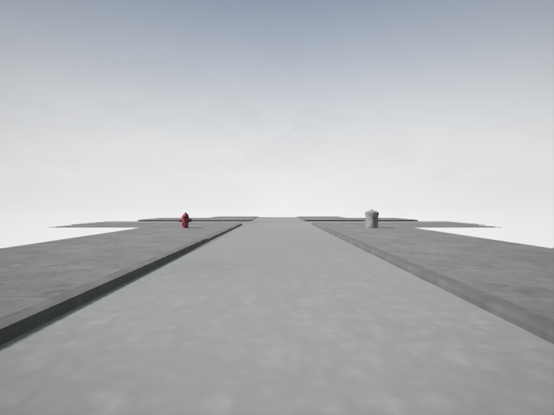
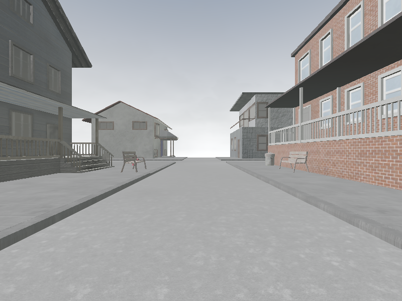
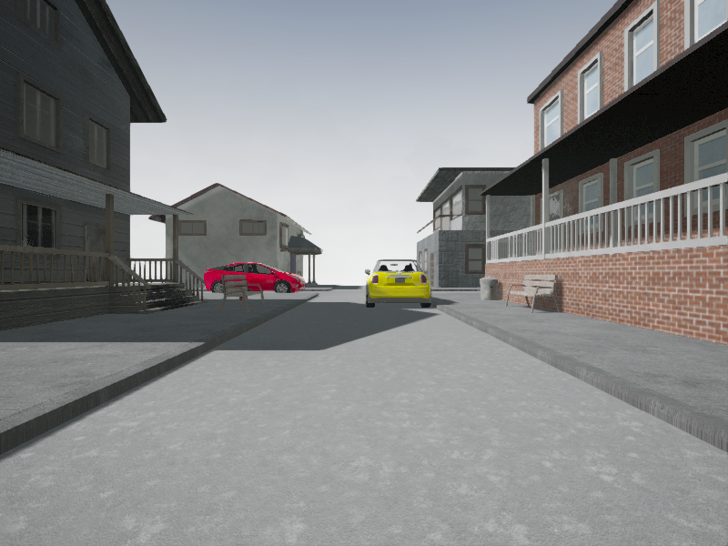

Spawning meshes
------------------------------

Examples of spawned scenes






To spawn these images, run the game and then execute mesh.py
### How to spawn static meshes with python

```
import sys
import os
import math
sys.path.append(
    'PythonAPI/dist/carla-0.9.0-py2.7-macosx-10.13-intel.egg')
from macchina.macchina import Macchina
from macchina.meshtag import MeshTag
from carla import *

client = Client("localhost", 2000)
world = client.get_world()
spectator = world.get_spectator()
HALF_PI = math.pi/2
PI = math.pi

macchina = Macchina(client, x=0, y=0, z=2, angle=0)

# Spawn a roadpart
macchina.addObject(MeshTag.RoadTwoLanes_LaneLeft, 0, 0, HALF_PI)

# Spawn the things
macchina.spawn()

# Set camera to see the things you've spawned
LOC = Location(x=-2, y=-4, z=3)
transform = Transform(LOC, Rotation(yaw=90))
spectator.set_transform(transform)
```
The tags you can use can be seen in *macchina/enum.py*

### How to add new static meshes with python
If you want to add new static meshes to the python API you need to follow the following steps.

1. Add a tag for the item you want to add in *CityMapMeshTag.h* In the MapGen folder in the Plugins folder.
2. Add the item you want to add to *MacchinaGenerator.cpp* in the plugin folder.
3. Add the tag of the item you want to add to "meshtag.py" in the macchina folder.
Don't forget to give it the correct index. If you want to automate this, use the "createEnumFromC.py" file.
To use this file make a file named needsConversion and paste in the contents of the *ECityMapMeshTag*
class.
E.x: 
```
RoadTwoLanes_LaneLeft               UMETA(DisplayName = "Road: Two Lanes - Lane Left"),
  RoadTwoLanes_LaneRight              UMETA(DisplayName = "Road: Two Lanes - Lane Right"),
  RoadTwoLanes_SidewalkLeft           UMETA(DisplayName = "Road: Two Lanes - Sidewalk Left"),
  RoadTwoLanes_SidewalkRight          UMETA(DisplayName = "Road: Two Lanes - Sidewalk Right"),
  RoadTwoLanes_LaneMarkingSolid       UMETA(DisplayName = "Road: Two Lanes - Lane Marking Solid"),
  RoadTwoLanes_LaneMarkingBroken      UMETA(DisplayName = "Road: Two Lanes - Lane Marking Broken"),

  Road90DegTurn_Lane0                 UMETA(DisplayName = "Road: 90 Degree Turn - Lane 0"),
  Road90DegTurn_Lane1                 UMETA(DisplayName = "Road: 90 Degree Turn - Lane 1"),
  Road90DegTurn_Lane2                 UMETA(DisplayName = "Road: 90 Degree Turn - Lane 2"),
  Road90DegTurn_Lane3                 UMETA(DisplayName = "Road: 90 Degree Turn - Lane 3"),
  Road90DegTurn_Lane4                 UMETA(DisplayName = "Road: 90 Degree Turn - Lane 4"),
  Road90DegTurn_Lane5                 UMETA(DisplayName = "Road: 90 Degree Turn - Lane 5"),
  Road90DegTurn_Lane6                 UMETA(DisplayName = "Road: 90 Degree Turn - Lane 6"),
  Road90DegTurn_Lane7                 UMETA(DisplayName = "Road: 90 Degree Turn - Lane 7"),
  Road90DegTurn_Lane8                 UMETA(DisplayName = "Road: 90 Degree Turn - Lane 8"),
  Road90DegTurn_Lane9                 UMETA(DisplayName = "Road: 90 Degree Turn - Lane 9"),
  Road90DegTurn_Sidewalk0             UMETA(DisplayName = "Road: 90 Degree Turn - Sidewalk 0"),
  Road90DegTurn_Sidewalk1             UMETA(DisplayName = "Road: 90 Degree Turn - Sidewalk 1"),
  Road90DegTurn_Sidewalk2             UMETA(DisplayName = "Road: 90 Degree Turn - Sidewalk 2"),
  Road90DegTurn_Sidewalk3             UMETA(DisplayName = "Road: 90 Degree Turn - Sidewalk 3"),
  Road90DegTurn_LaneMarking           UMETA(DisplayName = "Road: 90 Degree Turn - Lane Marking"),

  RoadTIntersection_Lane0             UMETA(DisplayName = "Road: T-Intersection - Lane 0"),
  RoadTIntersection_Lane1             UMETA(DisplayName = "Road: T-Intersection - Lane 1"),
  RoadTIntersection_Lane2             UMETA(DisplayName = "Road: T-Intersection - Lane 2"),
  RoadTIntersection_Lane3             UMETA(DisplayName = "Road: T-Intersection - Lane 3"),
  RoadTIntersection_Lane4             UMETA(DisplayName = "Road: T-Intersection - Lane 4"),
  RoadTIntersection_Lane5             UMETA(DisplayName = "Road: T-Intersection - Lane 5"),
  RoadTIntersection_Lane6             UMETA(DisplayName = "Road: T-Intersection - Lane 6"),
  RoadTIntersection_Lane7             UMETA(DisplayName = "Road: T-Intersection - Lane 7"),
  RoadTIntersection_Lane8             UMETA(DisplayName = "Road: T-Intersection - Lane 8"),
  RoadTIntersection_Lane9             UMETA(DisplayName = "Road: T-Intersection - Lane 9"),
  RoadTIntersection_Sidewalk0         UMETA(DisplayName = "Road: T-Intersection - Sidewalk 0"),
  RoadTIntersection_Sidewalk1         UMETA(DisplayName = "Road: T-Intersection - Sidewalk 1"),
  RoadTIntersection_Sidewalk2         UMETA(DisplayName = "Road: T-Intersection - Sidewalk 2"),
  RoadTIntersection_Sidewalk3         UMETA(DisplayName = "Road: T-Intersection - Sidewalk 3"),
  RoadTIntersection_LaneMarking       UMETA(DisplayName = "Road: T-Intersection - Lane Marking"),

  RoadXIntersection_Lane0             UMETA(DisplayName = "Road: X-Intersection - Lane 0"),
  RoadXIntersection_Lane1             UMETA(DisplayName = "Road: X-Intersection - Lane 1"),
  RoadXIntersection_Lane2             UMETA(DisplayName = "Road: X-Intersection - Lane 2"),
  RoadXIntersection_Lane3             UMETA(DisplayName = "Road: X-Intersection - Lane 3"),
  RoadXIntersection_Lane4             UMETA(DisplayName = "Road: X-Intersection - Lane 4"),
  RoadXIntersection_Lane5             UMETA(DisplayName = "Road: X-Intersection - Lane 5"),
  RoadXIntersection_Lane6             UMETA(DisplayName = "Road: X-Intersection - Lane 6"),
  RoadXIntersection_Lane7             UMETA(DisplayName = "Road: X-Intersection - Lane 7"),
  RoadXIntersection_Lane8             UMETA(DisplayName = "Road: X-Intersection - Lane 8"),
  RoadXIntersection_Lane9             UMETA(DisplayName = "Road: X-Intersection - Lane 9"),
  RoadXIntersection_Sidewalk0         UMETA(DisplayName = "Road: X-Intersection - Sidewalk 0"),
  RoadXIntersection_Sidewalk1         UMETA(DisplayName = "Road: X-Intersection - Sidewalk 1"),
  RoadXIntersection_Sidewalk2         UMETA(DisplayName = "Road: X-Intersection - Sidewalk 2"),
  RoadXIntersection_Sidewalk3         UMETA(DisplayName = "Road: X-Intersection - Sidewalk 3"),
  RoadXIntersection_LaneMarking       UMETA(DisplayName = "Road: X-Intersection - Lane Marking"),

  /*
   * BUILDINGS
   */

  House_AmerSuburb002_N2              UMETA(DisplayName = "Building: House suburb 002"),
  House_AmerSuburb003_N2              UMETA(DisplayName = "Building: House suburb 003"),
  House_AmerSuburb004_N2              UMETA(DisplayName = "Building: House suburb 004"),
  House_AmerSuburb005_N5              UMETA(DisplayName = "Building: House suburb 005"),
  House_AmerSuburb006_N2              UMETA(DisplayName = "Building: House suburb 006"),

  Props_Bench                         UMETA(DisplayName = "Prop: bench"),
  Props_Trashcan                      UMETA(DisplayName = "Prop: Trashcan"),
  Props_BusStop                       UMETA(DisplayName = "Prop: Bus stop"),
  Props_FireHydrant                   UMETA(DisplayName = "Prop: Fire hydrant"),

  /*
   * Vehicles
   */
  Vehicle_Toyota_prius                UMETA(DisplayName = "Vehicle: Toyota prius"),
  Vehicle_mini                        UMETA(DisplayName = "Vehicle: mini"),

  NUMBER_OF_TAGS         UMETA(Hidden),
  INVALID                UMETA(Hidden)
```

then just run the file. It will automatically create the following:

```
from enum import Enum

class MeshTag(Enum):
	RoadTwoLanes_LaneLeft = 0
	RoadTwoLanes_LaneRight = 1
	RoadTwoLanes_SidewalkLeft = 2
	RoadTwoLanes_SidewalkRight = 3
	RoadTwoLanes_LaneMarkingSolid = 4
	RoadTwoLanes_LaneMarkingBroken = 5
	Road90DegTurn_Lane0 = 6
	Road90DegTurn_Lane1 = 7
	Road90DegTurn_Lane2 = 8
	Road90DegTurn_Lane3 = 9
	Road90DegTurn_Lane4 = 10
	Road90DegTurn_Lane5 = 11
	Road90DegTurn_Lane6 = 12
	Road90DegTurn_Lane7 = 13
	Road90DegTurn_Lane8 = 14
	Road90DegTurn_Lane9 = 15
	Road90DegTurn_Sidewalk0 = 16
	Road90DegTurn_Sidewalk1 = 17
	Road90DegTurn_Sidewalk2 = 18
	Road90DegTurn_Sidewalk3 = 19
	Road90DegTurn_LaneMarking = 20
	RoadTIntersection_Lane0 = 21
	RoadTIntersection_Lane1 = 22
	RoadTIntersection_Lane2 = 23
	RoadTIntersection_Lane3 = 24
	RoadTIntersection_Lane4 = 25
	RoadTIntersection_Lane5 = 26
	RoadTIntersection_Lane6 = 27
	RoadTIntersection_Lane7 = 28
	RoadTIntersection_Lane8 = 29
	RoadTIntersection_Lane9 = 30
	RoadTIntersection_Sidewalk0 = 31
	RoadTIntersection_Sidewalk1 = 32
	RoadTIntersection_Sidewalk2 = 33
	RoadTIntersection_Sidewalk3 = 34
	RoadTIntersection_LaneMarking = 35
	RoadXIntersection_Lane0 = 36
	RoadXIntersection_Lane1 = 37
	RoadXIntersection_Lane2 = 38
	RoadXIntersection_Lane3 = 39
	RoadXIntersection_Lane4 = 40
	RoadXIntersection_Lane5 = 41
	RoadXIntersection_Lane6 = 42
	RoadXIntersection_Lane7 = 43
	RoadXIntersection_Lane8 = 44
	RoadXIntersection_Lane9 = 45
	RoadXIntersection_Sidewalk0 = 46
	RoadXIntersection_Sidewalk1 = 47
	RoadXIntersection_Sidewalk2 = 48
	RoadXIntersection_Sidewalk3 = 49
	RoadXIntersection_LaneMarking = 50
	House_AmerSuburb002_N2 = 51
	House_AmerSuburb003_N2 = 52
	House_AmerSuburb004_N2 = 53
	House_AmerSuburb005_N5 = 54
	House_AmerSuburb006_N2 = 55
	Props_Bench = 56
	Props_Trashcan = 57
	Props_BusStop = 58
	Props_FireHydrant = 59
	Vehicle_Toyota_prius = 60
	Vehicle_mini = 61
	NUMBER_OF_TAGS = 62
	INVALID = 63
```
 
